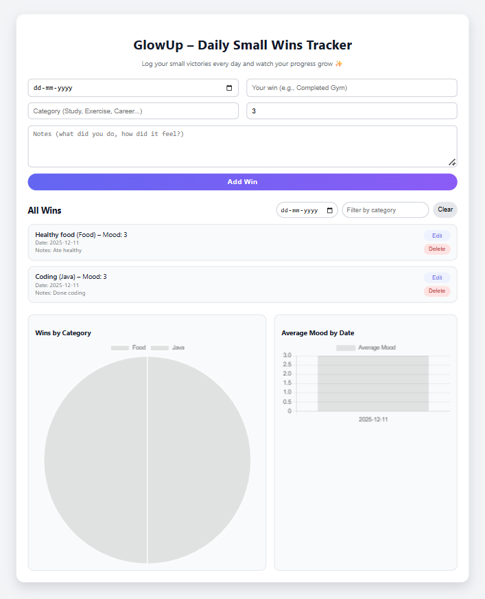
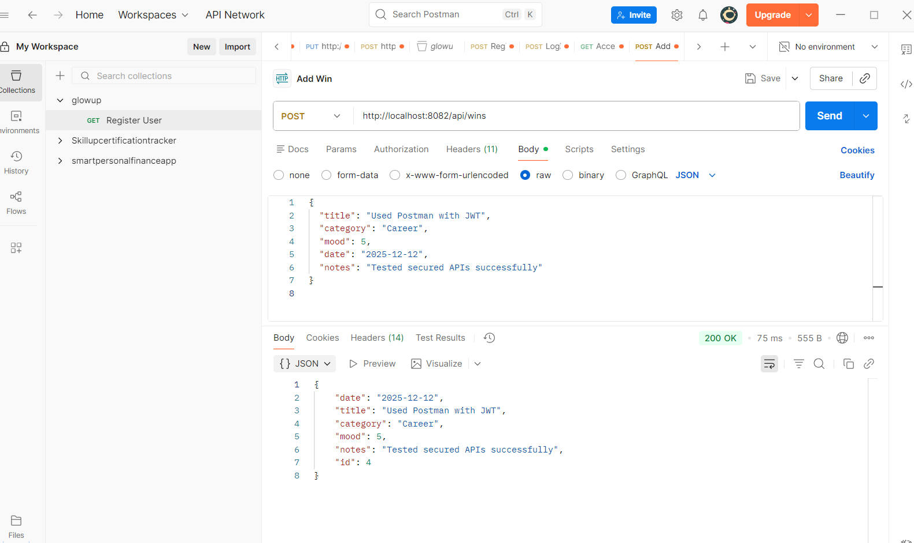

🌟 GlowUp – Daily Small Wins Tracker

A full-stack productivity application that helps users track small daily achievements, analyze mood patterns, and stay motivated over time.
Built using Spring Boot, React + Vite, MySQL, Docker, Chart.js, and a clean modern UI.

📌 Table of Contents

✨ Overview

🚀 Features

🧠 Tech Stack

🔐 Authentication & Security

🗄 API Endpoints

🧪 API Testing (Postman)

📦 Folder Structure

🐳 Running with Docker

▶️ Running Locally (Without Docker)

📸 Screenshots

🔮 Future Enhancements

📜 License

✨ Overview

GlowUp helps users log their daily small wins, track progress over time, and visualize emotional patterns using charts.

The application is fully Dockerized with separate containers for:

✅ Backend (Spring Boot)

✅ Frontend (React + Vite)

✅ Database (MySQL)

🚀 Features
🔹 Win Management (CRUD)

Add daily wins (title, category, mood rating, notes)

Edit existing wins

Delete wins

View all wins

🔹 Smart Filters

Filter wins by date

Filter wins by category

Clear filters instantly

🔹 Analytics Dashboard

Uses Chart.js to generate:

🥧 Pie Chart – Wins by Category

📊 Bar Chart – Average Mood by Date

🔹 Responsive UI

Clean modern layout

Mobile-friendly

Smooth interactions

🧠 Tech Stack
Frontend

React.js

Vite

Chart.js

Custom CSS

Backend

Java 17

Spring Boot 3+

Spring Data JPA

Spring Security

JWT Authentication

Hibernate ORM

Database

MySQL 8

Tools

IntelliJ IDEA

VS Code

Docker & Docker Compose

Postman

🔐 Authentication & Security

User registration & login using email and password

Passwords securely stored using BCrypt hashing

Stateless authentication using JWT (JSON Web Tokens)

APIs secured using Spring Security

Public access allowed only for:

/api/auth/register

/api/auth/login

All other APIs require a valid JWT token

🗄 API Endpoints
🔐 Authentication APIs

Base URL:

http://localhost:8082/api/auth

Method	Endpoint	Description
POST	/register	Register new user
POST	/login	Login user & get JWT
🏆 Win APIs (Protected)

Base URL:

http://localhost:8082/api/wins

Method	Endpoint	Description
GET	/api/wins	Fetch all wins
POST	/api/wins	Add a new win
PUT	/api/wins/{id}	Update a win
DELETE	/api/wins/{id}	Delete a win

🔒 Requires Authorization: Bearer <JWT_TOKEN>

🧪 API Testing (Postman)

All backend APIs are tested using Postman

Authentication flow tested:

Register user

Login user

Access protected endpoints using JWT

Postman screenshots are available in the /screenshots folder

📦 Folder Structure
glowup/
│── frontend/
│   ├── src/
│   ├── components/
│   ├── charts/
│   └── ...
│
│── glowup-backend/
│   ├── src/main/java/com/example/glowup_backend
│   │   ├── controller/
│   │   ├── service/
│   │   ├── repository/
│   │   ├── model/
│   │   ├── security/
│   │   └── config/
│
│── screenshots/
│── docker-compose.yml
│── README.md
│── LICENSE

🐳 Running with Docker (Recommended)
Prerequisites

Docker Desktop installed

Steps
git clone https://github.com/ramya3994/glowup.git
cd glowup
docker compose up --build

Access URLs

🔹 Frontend: http://localhost:5173

🔹 Backend: http://localhost:8082

🔹 MySQL: localhost:3307

Stop Containers
docker compose down

▶️ Running Locally (Without Docker)
Backend
cd glowup-backend
mvn spring-boot:run

Frontend
cd frontend
npm install
npm run dev

📸 Screenshots

🔮 Future Enhancements

Role-based authorization (Admin/User)

Dark mode UI

Weekly / Monthly mood analytics

Export insights as PDF

Streak tracking

Mobile app version

📜 License

This project is licensed under the MIT License.
See the LICENSE file for details.

✅ Status

Production-Ready
✔ Secure
✔ Dockerized
✔ Interview-Ready
✔ Clean Architecture
